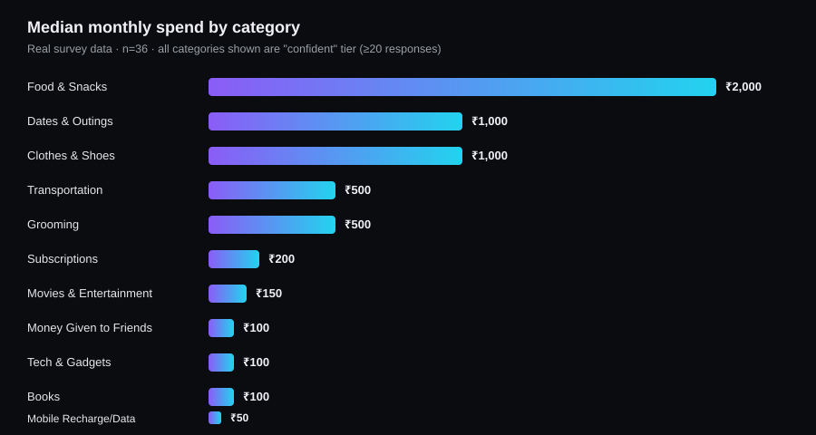
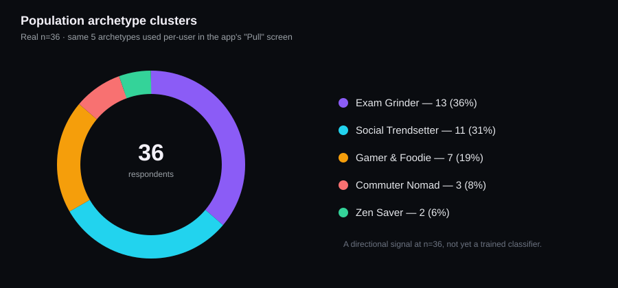
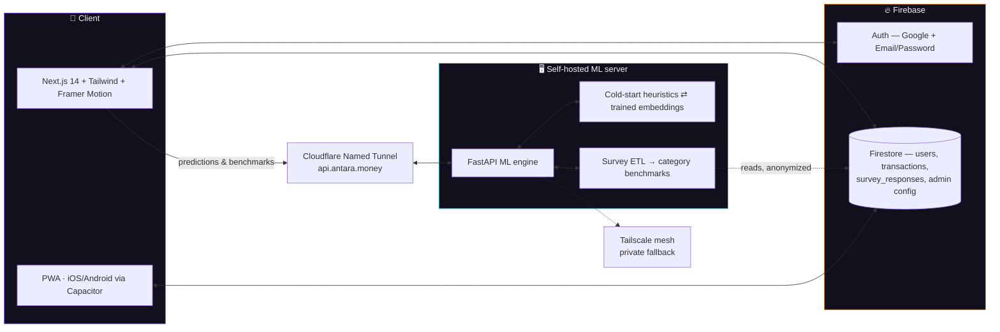

**A machine-learning expense tracker built specifically for Indian teenagers —**
**not a repackaged adult budgeting app.**

[antara.money](https://antara.money) · [Take the survey](https://survey.antara.money) · [Read the paper](https://antara.money)

 

> [!NOTE]
> Antara is in **live beta** with real users. Every statistic in this README is pulled from the project's own real, currently-collected survey data — nothing here is a mockup or placeholder number.

---

## Why this exists

Every personal-finance app on the market is built for someone with a salary, a credit history, and a monthly billing cycle. A 16-year-old managing ₹1,500–5,000 of pocket money across recharges, dates, coaching fees, and gifts to friends is structurally invisible to that entire category of software.

Antara logs that spend in the categories teens actually use, predicts near-term burn rate, and tells you — plainly, not with a wall of charts — where to cut back before the money's gone.

 

## What it looks like

| | |
|---|---|
| **Burn Gauge** — daily burn rate as a single glanceable dial, not a spreadsheet | **Pull** — a two-pole need/want physics canvas instead of a category pie chart |
| **Streaks** — daily logging habit loop, with earned freeze tokens | **Why this pace?** — plain-language ML coaching, not raw numbers |

 

## Real data, not a mockup

<b>Where these numbers come from</b>

 

An anonymous, unauthenticated survey (honeypot + minimum-completion-time bot filtering) collects self-reported spend across the same 18-category taxonomy the app itself uses — deliberately kept as one shared schema, not a research instrument that's silently drifted from the product. At current sample size (**n=36**), every category above has crossed the confidence threshold and is treated as **"confident,"** not an early estimate. Below that threshold, the app labels its own output as an early estimate rather than pretending to more certainty than the data supports — including a literal ₹0 median being left un-capped for five categories (investments, fitness, in-app gaming, tuition, donations) rather than flagging every first rupee logged as "over budget."

 

## Architecture

No inbound port-forwarding anywhere in this path — public access runs through a named Cloudflare Tunnel, with a private Tailscale route kept as an independent fallback.

 

## Stack

| Layer | Tech |
|---|---|
| Frontend | Next.js 14 (App Router), Tailwind CSS, Framer Motion |
| Native shells | Capacitor (iOS + Android), wrapping the live web app |
| Backend | FastAPI (Python), self-hosted |
| Data | Firebase Auth, Cloud Firestore |
| Connectivity | Cloudflare Named Tunnel + Tailscale (fallback) |
| Domain | [antara.money](https://antara.money), Cloudflare DNS |

 

## Feature status

- [x] Google + email/password auth, beta allowlist gate
- [x] Burn-rate dashboard, Pull (need/want) canvas
- [x] Editable monthly budget, transaction log/edit/delete
- [x] Daily streaks with freeze tokens
- [x] Survey-grounded cold-start ML benchmarks (n=36 and growing)
- [x] "Why this pace?" plain-language coaching layer
- [x] PWA install (iOS + Android), splash screens, offline app-shell
- [x] Native haptics + sound on iOS/Android via Capacitor
- [x] Public-signup toggle (config-gated, off by default), Privacy/Terms pages
- [ ] Public launch (superadmin's call — not flipped yet)
- [ ] Phase 2: conversational voice-logging agent
- [ ] Trained per-user embeddings (pending sufficient real transaction volume)

 

## Team

**Parth Chhabra** — Founder & Lead Engineer
**Daksh Trivedi** — Co-Founder

 

Built with real survey data, a self-hosted ML server, and an unreasonable amount of honesty about sample sizes.

[antara.money](https://antara.money)

